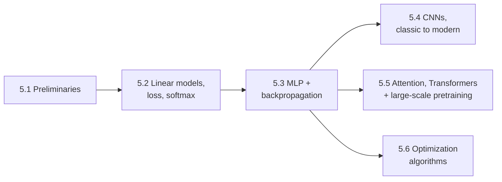

**Status:** Draft · **Domain:** `tiferet-dl` · **Code:** (not yet implemented) · **Branch:** `docs-core-domain-vision-and-distillation`
**Companion:** `docs/domain-vision.md`

# tiferet-dl: Core Domain Distillation

## 1. Purpose of this document
This is a **forward-looking** distillation: `tiferet-dl` has no code yet, only a README describing intent. Its job is to fix the domain's vocabulary, scope, and internal seams *before* implementation starts, so that the first technique notes written into this collection are consistent with each other instead of improvised independently. Read this before adding a new technique note, and read it before proposing that any pattern found here be adapted into the official Tiferet ecosystem — §8 and §10 exist specifically to make that later conversation scopeable.

Because there is no code to cite, every claim below is grounded instead in the domain's actual source of truth: the ECE 425/525 *Introduction to Deep Learning: An Engineering Perspective* syllabus (Fall 2026, Dr. Jyotikrishna Dass, University of Arizona) and its assigned textbook, Zhang, Lipton, Li, and Smola, *Dive into Deep Learning* (d2l.ai, Cambridge University Press, 2023). This is a **v1-scoped** revision (see `.handoff/v1-vision-release.md`): it gives full behavior treatment only to course units with a fixed, citable textbook chapter, and tracks everything else as a named backlog (§10a) rather than drafting it now.

## 2. The core domain, restated precisely
The domain's shape is a short, repeatable pipeline:

1. **Ingest** a technique named in the course syllabus.
2. **Distill** its principle from the assigned textbook chapter (or, when none exists, from the best available named source).
3. **Re-express** that principle as a written technique note, independent of any specific homework deliverable.
4. **Record** what, if anything, the technique implies for the wider Tiferet ecosystem — without committing to build it.

Four **axes of variation** cut across every technique this domain will ever ingest, and every behavior in §5 is judged against them:

- **Model family** — the architecture doing the computation: multilayer perceptron (dense), convolutional network, or attention-based Transformer.
- **Learning regime** — how the model acquires its parameters: supervised training from scratch, self-supervised pretraining, or fine-tuning/adaptation of an already-pretrained model.
- **Efficiency concern** — what resource a technique is trying to conserve: compute (FLOPs), memory (parameter count or inference-time cache), or data (labeled examples, or centralization of data across parties).
- **Source maturity** — whether the technique has a citable textbook chapter behind it, or is a syllabus-listed "additional resources" topic with no fixed citation yet.

Naming these axes up front is what makes it possible to later ask, precisely, which of a technique's properties are incidental to *this course's* framing and which are load-bearing for the principle itself. Note that in v1, the confirmed spine (§5) does not yet exercise the efficiency-concern axis directly — that axis mainly governs the backlog (§10a) and will matter once those items are promoted.

## 3. Ubiquitous language
- **Loss function** — a scalar score, computed from a model's prediction and the true answer, that training tries to minimize.
- **Empirical risk / risk** — empirical risk is the average loss over the training set; risk is the (unobservable) expected loss over the whole data distribution. The gap between them is the generalization problem.
- **Backpropagation** — the algorithm that computes how much each parameter contributed to the loss, by applying the chain rule backward through the computational graph.
- **Gradient descent / stochastic gradient descent (SGD) / minibatch SGD** — three points on a spectrum of how much data is used to estimate the gradient before each parameter update: all of it, one example, or a small batch.
- **Momentum** — an optimizer modification that accumulates a running average of past gradients so updates keep moving in a consistent direction.
- **Adaptive optimizer** — an optimizer (Adagrad, RMSProp, Adam) that gives each parameter its own effective learning rate based on the history of its gradients.
- **Learning rate schedule** — a rule for changing the learning rate over the course of training, rather than holding it fixed.
- **Activation function** — the nonlinearity applied after a layer's linear transformation; without it, stacked layers would collapse into one linear function.
- **Multilayer perceptron (MLP)** — a model made of stacked fully connected layers separated by activation functions.
- **Convolution** — a linear operation that applies the same small set of weights (a kernel) across every spatial location of its input, giving the model translation invariance.
- **Receptive field** — the region of the original input that a given unit's output value depends on.
- **Pooling** — an operation that reduces spatial resolution by summarizing (e.g., taking the max or average of) small neighborhoods.
- **Batch normalization** — a technique that rescales a layer's activations using statistics computed per training batch, stabilizing training in deep networks.
- **Residual connection** — a shortcut that adds a layer's input directly to its output, letting gradients skip layers during backpropagation.
- **Dropout** — a regularization technique that randomly zeroes a fraction of activations during training to discourage over-reliance on any single unit.
- **Softmax / cross-entropy** — softmax turns raw scores into a probability distribution over classes; cross-entropy is the loss function that scores that distribution against the true class.
- **Attention (query, key, value)** — a mechanism where a query is compared against a set of keys to produce weights, which are then used to combine the corresponding values into an output.
- **Attention scoring function** — the specific comparison used between a query and a key (e.g., dot product, scaled dot product, additive).
- **Self-attention** — attention where the queries, keys, and values all come from the same sequence, so every position can attend to every other position.
- **Positional encoding** — information injected into a sequence's representation so a self-attention model, which has no inherent notion of order, can still use position.
- **Multi-head attention** — running several attention computations in parallel with different learned projections, then combining the results.
- **Transformer block** — the combination of self-attention, a position-wise feed-forward network, residual connections, and normalization that is stacked to build a Transformer.
- **Encoder-only / decoder-only / encoder–decoder** — the three ways a Transformer can be assembled: representation-only (e.g., BERT-style), autoregressive generation-only (e.g., GPT-style), or both connected by cross-attention (e.g., translation-style).
- **Vision Transformer (ViT)** — an encoder-only Transformer applied to image patches instead of text tokens.
- **Pretraining / fine-tuning** — pretraining trains a model on a large, generic objective; fine-tuning further trains (all or part of) that model on a smaller, task-specific dataset.
- **Distribution shift** — when the data a model is used on differs systematically from the data it was trained on, breaking the assumption that training and deployment data match.

Backlog topics named in §10a — parameter-efficient fine-tuning (PEFT)/LoRA, KV cache, efficient attention, federated learning, pruning, sparsity, quantization, scaling laws, and foundation models — are **intentionally not defined here**. Per the v1 handoff, this glossary is seeded from the confirmed spine only; each of those terms enters it once its backlog item is promoted with a citable source (§10a).

## 4. What the domain reads / operates on
The domain's primary inputs are:

- **The course syllabus** — its "Course Topics" table is the authoritative list of what counts as in-scope, and its ordering is the sequencing this domain draws its dependency structure from (see §6).
- **The assigned d2l.ai chapters for the v1 confirmed spine**, confirmed against the live table of contents: Chapters 1–2 (Introduction, Preliminaries), 3–4 (Linear Neural Networks, Loss Functions, Softmax), 5 (Multilayer Perceptrons, incl. backpropagation and dropout), 7–8 (Convolutional Neural Networks, classic and modern), 11 in full (Attention Mechanisms and Transformers, including Vision Transformers and BERT/T5-style pretraining, §11.1–11.9), and 12 (Optimization Algorithms).
- **The two reference texts**, used to triangulate a definition or fill a gap the assigned chapters leave thin: Bishop & Bishop, *Deep Learning: Foundations and Concepts* (2024), and Prince, *Understanding Deep Learning* (2023).
- **v1 backlog topics** — named and tracked (§10a), but explicitly **out of scope for citation-backed behavior treatment** until the course supplies a citable source: full-scale LLMs/scaling laws beyond d2l §11.9; Efficient DL Techniques Part I (PEFT/LoRA, KV cache, efficient attention, federated learning); LLM Alignment, RAG, AI Agents, Reasoning; Efficient DL Techniques Part II beyond dropout (pruning, sparsity, quantization); Advanced Models (multimodal, diffusion, mixture of experts).

The convention that gives this domain its leverage is simple: **every technique note names its source's chapter/section when one exists, and stays in the backlog, undrafted, when it doesn't.** This is what lets §5's agnostic/variable verdicts and §10's forward-looking proposals be trusted later.

## 5. The behaviors
Each behavior below corresponds to one unit of the **v1 confirmed spine** — the six course units with a fixed, citable textbook chapter (see `.handoff/v1-vision-release.md`). For each: *what it does* (one line), its source, what it produces, and its agnostic/variable verdict against the axes named in §2. Backlog topics (§10a) are intentionally not drafted as behaviors here.

### 5.1 Preliminaries and foundations
*Establishes the mathematical vocabulary — tensors, linear algebra, calculus, automatic differentiation, and probability — that every later technique assumes.* Source: d2l Ch. 1–2. Produces: a shared-vocabulary technique note with no model-family content of its own. Verdict: **agnostic** — nothing here varies by model family, learning regime, or efficiency concern; it is the substrate all of §2's axes sit on top of.

### 5.2 Linear models, loss functions, and softmax
*Introduces the smallest complete learning loop: a linear model, a loss function (squared error for regression, cross-entropy for classification via softmax), the training-error/generalization-error distinction, and distribution shift as the reason a model that generalized in testing can still fail in deployment.* Source: d2l Ch. 3–4. Produces: a technique note on the loss-minimization loop and on generalization (including distribution shift) as concepts distinct from optimization. Verdict: **agnostic** on the training-loop shape (applies to every later model family); **variable** on which loss function is appropriate, which depends on the task.

### 5.3 Multilayer perceptrons and backpropagation
*Adds hidden layers and an activation function between them, then derives backpropagation as the mechanism that makes training a deep, nonlinear model tractable; also introduces dropout as a regularizer.* Source: d2l Ch. 5. Produces: a technique note on backpropagation as an agnostic mechanism, plus a separate note on dropout. Verdict: backpropagation is **agnostic** — every later architecture in this collection is trained by the same chain-rule mechanism; the specific architecture (and activation function) backpropagation is applied to is the **variable** part.

### 5.4 Classic and modern convolutional networks
*Replaces full connectivity with convolution to exploit spatial structure — using receptive field and pooling to control what each unit sees and at what resolution — then walks through the architectural lineage (LeNet, AlexNet, VGG, NiN, GoogLeNet, batch normalization, ResNet/ResNeXt, DenseNet) that made deep CNNs trainable and effective.* Source: d2l Ch. 7–8. Produces: a technique note on convolution, receptive field, and pooling as a family of related inductive biases, and a second note on the specific architectural tricks (residual connections, batch normalization) that generalize beyond CNNs. Verdict: convolution, receptive field, and pooling are **variable** (model-family choices); residual connections and batch normalization are closer to **agnostic**, since both reappear, in adapted form, in the Transformer block covered next.

### 5.5 Attention, Transformers, and large-scale pretraining
*Builds up attention from a soft query/key/value lookup, through learned attention scoring functions and multi-head attention, to self-attention with positional encoding and the full Transformer block (self-attention plus a feed-forward network, residual connections, and normalization) — then applies that block to image patches (Vision Transformer) and to text at scale via the three pretraining assembly modes: encoder-only, encoder–decoder, and decoder-only (e.g., BERT/T5-style).* Source: d2l Ch. 11, in full (§11.1–11.9) — this is now a single confirmed-spine unit per the v1 handoff, since the whole chapter is citable. Produces: three separate technique notes — the attention mechanism (incl. positional encoding), the Transformer block, and the ViT/pretraining-assembly-mode framework — kept distinct rather than merged into one, since the chapter itself introduces them as separable ideas (see the entanglement note in §8). Verdict: **variable** relative to CNNs and MLPs (a distinct model family); internally, the query/key/value computation is **agnostic** to modality — the same mechanism underlies both the text Transformer and the Vision Transformer.

### 5.6 Optimization algorithms
*Surveys the algorithms that actually perform the parameter update implied by backpropagation's gradient: (stochastic/minibatch) gradient descent, momentum, and the adaptive family (Adagrad, RMSProp, Adadelta, Adam), plus learning-rate scheduling and a primer on convexity.* Source: d2l Ch. 12. Produces: a technique note per optimizer family, framed as interchangeable implementations of the same update-rule contract. Verdict: **agnostic** — every model family and learning regime in this collection uses one of these optimizers; which one, and with what schedule, is the **variable** hyperparameter choice.

## 6. How the behaviors compose
The v1 spine composes as a shallow dependency graph rather than a strict linear sequence: Preliminaries and the linear-model loop are prerequisites for everything else, and CNNs, Attention/Transformers, and Optimization Algorithms are three siblings built on that shared foundation rather than a chain running through each other.

Note that the course itself skips recurrent neural networks (d2l Ch. 9–10) entirely, moving from MLP/backpropagation directly to attention. This is a deliberate scope decision worth preserving in this collection rather than "fixed": `tiferet-dl` should treat attention as the sequence-modeling baseline it inherits, not silently backfill recurrence the syllabus chose to skip.

The v1 backlog (§10a) would, if promoted, attach downstream of this graph rather than inside it: Efficient DL I/II assume a trained model from D or E already exists to be made efficient, and full-scale LLM/scaling-law content extends E. That relationship is noted here for when promotion happens; it is not drawn into the diagram while the backlog remains undrafted.

## 7. Relationships / cross-boundary rules
Three external structures bound what can go into this domain and when:

- **The graded-activity calendar** sets a rough cadence, not a strict dependency: four assignments (due weeks 4, 7, 11, and 13) and two in-class exams (weeks 9 and 15) fall across the topic sequence, so technique notes for early units (§5.1–§5.3) have reason to exist before the first assignment's due date, without this domain being able to assume any specific assignment maps to any specific unit — the syllabus does not state that mapping, and this document does not invent one.
- **The team project** (in place of a final exam, 2–3 students, creative/novel/applied) is the one course deliverable structurally likely to *use* several technique notes at once rather than exercise a single unit in isolation; judging whether a given technique note is "reusable" should account for this.
- **The course's AI-use policy** ("green/yellow/red light" per assessment; generative AI permitted with citation for quizzes, assignments, and projects, but not for exams) bounds how a technique note may legitimately be produced: a note may be drafted with AI assistance and cited as such, but it must not become a channel for exam content, and it does not substitute for the student's own independent understanding of graded material.

## 8. The agnostic core and the variable edge
**Built once (agnostic core):**
- Loss minimization via gradient-based optimization (§5.2, §5.6) — every technique in this collection is trained this way, regardless of architecture.
- The empirical-risk-vs-risk (generalization) discipline (§5.2) — a property of the learning problem, not of any one model family.
- The forward-pass → loss → backward-pass → parameter-update training-loop shape (§5.3, §5.6).
- The citation-first authoring discipline defined in §1 and §4 — not a DL principle itself, but the domain's own agnostic method for deciding what belongs in it, and the reason v1 narrowed to a confirmed spine instead of covering the full syllabus at once.

**Varies per case (variable edge):**
- Architectural inductive bias: dense (§5.2–§5.3), convolutional (§5.4), or attention-based (§5.5).
- Which optimizer and learning-rate schedule is chosen (§5.6).
- Data modality and task framing (text, image patches; classification, regression, or generation).

**Honest entanglement inventory** (conceptual, since no code exists yet to point at — these are traps to watch for once implementation starts):
- §5.5 now bundles three previously-separable ideas — the attention mechanism, the Transformer block, and the ViT/pretraining-assembly-mode framework — into one behavior entry because they share a single citable chapter. The technique notes it produces must still be written as three separate notes; collapsing them into one note because they share a behavior entry would recreate the exact conflation this document exists to avoid.
- Generalization (§5.2) is introduced inside the classification chapter and could be mistaken for a classification-specific or CNN-specific concern; it is not — it applies to every learning regime named in §2.
- The confirmed-spine/backlog split (§5 vs. §10a) exists specifically to stop uncited claims from acquiring the same perceived authority as cited ones. If a future revision promotes a backlog item into §5 on the reasoning that "the course will probably cover it eventually" rather than an actual citable source, that defeats the purpose of the split.
- When backlog items are eventually promoted (§10a), the syllabus's own grouping should not be treated as authoritative: "Efficient DL Techniques – Part I" bundles PEFT/LoRA, KV cache, efficient attention, and federated learning under one heading, but they address four different problems — fine-tuning cost, inference cost, attention's compute cost, and data-centralization cost, respectively — and should very likely become separate technique notes, not one.

## 9. Boundaries
**Inside this domain:** technique notes tied to a named source (per §1, §4), the glossary (§3), and the agnostic/variable analysis (§5, §8) that make those notes comparable to each other — currently, the six v1 confirmed-spine behaviors only.

**Outside this domain, and who owns it instead:**
- Production training infrastructure, model serving, and MLOps — owned by any future, separately chartered Tiferet DL runtime proposal, not by this collection (see `docs/domain-vision.md`, "What it deliberately does not do").
- The university's D2L grading system, grading policy, and administration of the course itself — owned by the course and its instructor.
- Original research or literature synthesis beyond what the syllabus assigns — if pursued, that belongs in a literature-tracking system such as `tiferet-lit-review`, not in this technique collection.
- The actual answers to graded coursework — owned by the student's own independent effort, per the course's academic integrity policy (see §7).
- **For v1 specifically**, every backlog topic named in §10a — full-scale LLMs/scaling laws beyond Ch. 11.9, Efficient DL I (PEFT/LoRA, KV cache, efficient attention, federated learning), LLM alignment/RAG/agents/reasoning, Efficient DL II beyond dropout (pruning, sparsity, quantization), and Advanced Models — is out of scope for drafted behavior treatment until it clears the promotion bar in §10a. It is tracked, not distilled.

## 10. Where this leads

### 10a. v1 backlog — promote only once citable
Each item below stays a named backlog entry, not a drafted behavior, until the course supplies a citable source (an assigned reading, a named paper, or documented guest-lecture material). Do not promote an item using general or background knowledge — that defeats the citation discipline this document is built on.

1. Full-scale LLMs and scaling laws beyond d2l §11.9 (GPT-era models, foundation models).
2. Efficient DL I — parameter-efficient fine-tuning (LoRA), KV cache, efficient attention, federated learning. When promoted, keep these as separate technique notes (see §8), since they solve different problems.
3. LLM alignment, RAG, AI agents, and reasoning — dependent on guest lectures the syllabus has not yet named a source for.
4. Efficient DL II beyond dropout — pruning, sparsity, and quantization (dropout itself is already covered under §5.3).
5. Advanced models — multimodal models, diffusion models, mixture of experts — explicitly conditional in the syllabus ("if time permits").

### 10b. Candidate Tiferet-ecosystem principles
Each item below is a candidate for its own future RFP/TRD against the official Tiferet ecosystem — none of them are committed to by writing this document, and none should be started before the corresponding technique notes in §5 (or, for backlog-derived items, a promoted §10a entry) actually exist to ground them.

1. **Config-driven training-pipeline proposal** — once §5.2–§5.3 and §5.6 produce enough technique notes, evaluate whether a declarative, `feature.yml`-style description of a training run's steps is a natural fit for Tiferet's existing feature/DI conventions.
2. **Efficiency-technique-as-pluggable-service proposal** — once §10a's Efficient DL I/II items are promoted with technique notes, evaluate modeling pruning, quantization, PEFT, and KV cache as flagged, swappable services rather than architecture-specific code, mirroring Tiferet's flagged-dependency DI design.
3. **Generalization/evaluation-discipline proposal** — evaluate whether the empirical-risk-vs-risk contract named in §8 is worth formalizing as a first-class evaluation service for any future Tiferet capability that fits a model to data.
4. **Agnostic-core/variable-edge documentation template proposal** — evaluate reusing this document's §2/§8 pattern (named axes of variation plus a three-list agnostic/variable/entanglement split) as the standard shape for distilling any future pluggable-model domain, inside or outside `tiferet-dl`.
5. **Citation-discipline contribution gate** — before this collection grows past its first few technique notes, evaluate formalizing "every technique traces to a named source" (§1, §4) — and the confirmed-spine/backlog split that enforces it in v1 — as an explicit, checkable contribution rule for `tiferet-dl` itself.
